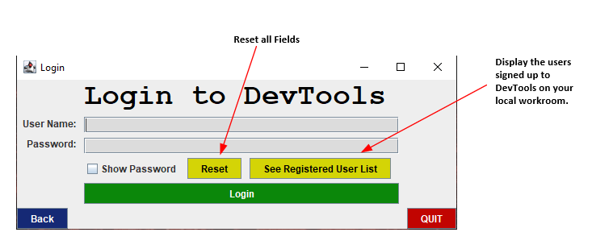

# DevTools 

A File/Object converter utility for software developers built using java for CPSC 210.

<!-- TABLE OF CONTENTS -->
## Table of Contents

* [About the Project](#about-this-project)
* [Tools and Technologies Used / Built With](#built-with)
* [How it Works](#how-it-works)
* [Developed By](#developed-by)
* [About Me and Why I built this Project](#about-me-and-why-i-built-this-project)
* [Getting Started](#getting-started)
    * [System Requirements / Prerequisites](#system-requirements--prerequisites)
    * [Installation](#installation)
* [License](#open-source-license)
* [Usage/API Docs](#usage--api-docs)
* [Pull Requests](#pull-requests)
* [Contact](#contact)
* [Acknowledgements](#acknowledgements)
* [User Stories - Phase 1](#user-stories-for-phase-1---data-model--console-based-user-interface)
* [User Stories - Phase 2](#user-stories-for-phase-2---data-persistence)
* [User Stories - Phase 3](#user-stories-for-phase-3---graphical-user-interface-)
* [User Stories - Phase 4](#user-stories-for-phase-4---implementing-design-concepts-)

## About This Project

This project is a File/Object converter utility for software developers. 
Many software developers require conversion of files and data to another forms such as JSON
to push to their database or for data analysis. Developers often do not want to use free online
tools to convert their data due to privacy reasons. This open source software can be used as
a utility in their code. Moreover, this project is fully extensible.

## Built With
* [java](https://www.java.com/en/)
* [javax.swing](https://docs.oracle.com/javase/7/docs/api/javax/swing/package-summary.html)
* [Apache-POI](https://poi.apache.org/)

## How It Works
Utilizes open source Apache File reader APIs and object construction to perform the necessary file 
conversions. Uses those scanners to Stream read every file and perform necessary object construction / conversion.
Custom API docs for this software's usage will be released in the future.
Note : This software is not a product of Apache software foundation. 

## Developed By

- [Vishal Desh](https://github.com/VDeshh)

## About me and Why I built this project
I'm Vishal Desh in year 2 pursuing Bachelor of Science and Master of Management. I am passionate about software development. I worked on some software projects and participated in 
several hackathons over the summer. I had to use a lot of databases for my projects (Firestore, MongoDB etc.) which 
 majorly used JSON structures. I had to convert the data fetched from the APIs to JSON. Similarly, when I query the database I had to read and process JSON structures. I felt the need for a secure utility which would do this job for me. This was not the only time I need this utility. Even in my data science class I had to convert excel / web scraped tables to CSV files. I soon found the need to build something which would be useful for me and would also contribute to the open source community. The libraries exist, but I found the need to build myself a secure all-in-one platform which is fully extensible. CPSC 210’s personal project is a great opportunity for me to build this and get guidance for making this project successful with an interactive UI. 

## Getting Started
Follow these steps to get the software up and running on your local machine.
### System Requirements / Prerequisites
MAC OS:
1. Intel-based Mac running Mac OS X 10.8.3+, 10.9+
2. Administrator privileges for installation
3. 64-bit browser

WINDOWS:
1. Windows Server 2008 R2 SP1 (64-bit) and above
2. RAM: 128 MB
3. Disk space: 124 MB for JRE; 2 MB for Java Update
4. Processor: Minimum Pentium 2 266 MHz processor
5. Browsers: Internet Explorer 9 and above, Firefox

STEPS:
1. Get java IDE installed. 
2. To test and modify the code have Amazon Correto JDK 8 installed
 
```sh
jre [INSTALLCFG=configuration_file_path] [options]
```

### Installation

1. Clone the repo
```sh
git clone https://github.students.cs.ubc.ca/CPSC210-2020W-T1/project_w6y2b.git
```

2. Open Source Code on any java IDE.


## Open Source License

```
Copyright (C) 2020 Vishal Desh

This program is free software: you can redistribute it and/or modify
it under the terms of the GNU General Public License as published by
the Free Software Foundation, either version 3 of the License, or
(at your option) any later version.

This program is distributed in the hope that it will be useful,
but WITHOUT ANY WARRANTY; without even the implied warranty of
MERCHANTABILITY or FITNESS FOR A PARTICULAR PURPOSE.  See the
GNU General Public License for more details.

You should have received a copy of the GNU General Public License
along with this program.  If not, see <http://www.gnu.org/licenses/>.
```

## Usage / API Docs

### GUI Tutorial




`API docs and video tutorials - To be updated soon.....`

## Pull Requests

1. Just fork a version of this repository, make the changes you want to, and make a pull request.
2. I will review the pull request, and accept or reject any incoming changes after testing.

## Contact

Vishal Desh - [LinkedIn](https://www.linkedin.com/in/vishal-desh-6294141b1) - emailtovishy@gmail.com

Personal Website: [Link](http://vishaldesh.com/)

## Acknowledgements
* [Apache POI HSSF and XSSF Examples ](http://poi.apache.org/components/spreadsheet/examples.html)
* [Apache POI Tutorial by Code Java ](https://www.codejava.net/coding/how-to-write-excel-files-in-java-using-apache-poi)
* [JSON load/save data UBC ](https://github.students.cs.ubc.ca/CPSC210/JsonSerializationDemo)
* [Swing Tutorial for Combo Box](https://www.geeksforgeeks.org/java-swing-jcombobox-examples/)
* [Introduction to Swing Tutorial](https://www.youtube.com/watch?v=5vSyylPPEko)
* [Login Application Swing Tutorial](https://www.youtube.com/watch?v=5vSyylPPEko)
* [Swing Tutorial for Forms in inteliJ](https://www.youtube.com/watch?v=G1Zo3UKzB4A)

## User Stories For Phase 1 - Data Model + Console Based User Interface: 

- As a User, I want to be able to read all the Source File Formats
- As a User, I want to be able to display the current Source File contents in the Console based UI
- As a User, I want to be able to convert the file into another File Type Object
- As a User, I want to be able to Navigate through a user-friendly Console UI
- As a User, I want to be able to provide commands for particular file conversions 
(eg: Providing the Delimiter for Text File data conversion)


#### Checklist for testing this project for Phase 1: 

##### 1. Followed the console

##### 2. Test every type of file read - Files have been uploaded to the data folder in this project 

- Path for Excel File Test : `./data/student.xlsx`
- Path for Text File Test : `./data/gdpdemo.txt`
- Path for XML File Test : `./data/XMLFile.xml`
- Path for CSV File Test : `./data/SampleData.csv`

##### 3. File conversion tests :

- Excel to JSON (Returns JSON object and then converted to String)


## User Stories For Phase 2 - Data Persistence:
- As a User, I want to be able to perform a file conversion and save it in the new format in my disk
- As a User, I want to be able to login (Load and Read from Workroom) to use this application
- As a User, I want to provide access permission to add kids to this application
- As a User, I want to be able to sign-up (Save to WorkRoom) as a new user and get added to the workroom of this application (Multiple X -> Y)

#### Checklist for testing this project for Phase 2:
 
##### 1. Followed the console

##### 2. Test every type of file read - Files have been uploaded to the data folder in this project 

- Path for Excel File Test : `./data/student.xlsx`
- Path for Text File Test : `./data/gdpdemo.txt`
- Path for XML File Test : `./data/XMLFile.xml`
- Path for CSV File Test : `./data/SampleData.csv`

This will now be followed by a prompt to save in your data folder.

##### 3. Data Persistence Test 1:
- Follow the console to login or create an User account.
- You will be able to manually view the Json file in the data folder.
- You can allot access permission as true and false for the users you create and 
test that by following the UI.

##### 3. Data Persistence Test 2:
- All the file conversions can now be saved to your disk in the appropriate
file format and extension. 
- Follow the UI to write to the data file path and then view it on inteliJ.

## User Stories For Phase 3 - Graphical User Interface :
- As a User, I want to be able to navigate through a user-friendly GUI.
- As a User, I want to be able to login (Load and Read from Workroom) to use this application.
- As a User, through the GUI, I want to be able to sign-up (Save to WorkRoom) as a new user and get added to the workroom of this application (Multiple X -> Y)
- As a User, through the GUI, I want to see all the names / user names registered in my Work Room / System (Displaying a subset of X's in Y)
- As a User, through the GUI, I want to be able to Login (Read from WorkRoom) to use the DevTools Utility Hub. 
- As a user, Through the GUI, I want to be able to perform all types of file conversions
- As a user, I should be able to hear sounds when I click a buttons (Audio-Visual Component).

#### Checklist for testing this project for Phase 3:
 
##### 1. Run MainGUI to run the graphical user interface (GUI).

##### 2. Test every type of file read - Files have been uploaded to the data folder in this project. 

- Path for Excel File Test : `./data/student.xlsx`
- Path for Text File Test : `./data/gdpdemo.txt`
- Path for XML File Test : `./data/XMLFile.xml`
- Path for CSV File Test : `./data/SampleData.csv`

##### 3. Play around with the GUI to test functionality. 

##### 4. WorkRoom can be manually checked on inteliJ. 


## User Stories For Phase 4 - Implementing Design Concepts :
### Phase 4 - Task 2 : Using Design Concepts :
`Chosen Option : Make appropriate use of the Map interface somewhere in your code.`
- Used Map interface in `Read and Operate CSV` class to create a JSON structure by mapping all the values in a CSV file 
separated by commas using a `CSVMapper` and placing them in the `Map` using a `Mapping iterator`. I have used this to construct
a JSON structure which can then be written into a JSON File.

### Phase 4 - Task 3: 
#### UML Design Explanation
UML Class Level Diagram Located in Path : `./UML Class Diagram for DevTools.png`

##### Relationship between the Models
All the model classes had a Test class which tested it (uni-directional)

1. Class `Login` :
Has an object of User,Workrrom and JsonWriter, JsonReader each as its data members

2. Class `WorkRoom`:
Has two instances of a dependency with a User Object. 
(Temporarily uses the user object in its function body)

3. Class `User`:
Implements Writable. The dotted line used here doesnt have a white arrow head.

4. Class `JsonReader`:
Has two instances of a dependency with a WorkRoom Object. 
(Temporarily uses the user object in its function body)

5. Class `JsonWriter`:
Has two instances of a dependency with a WorkRoom Object. 
(Temporarily uses the user object in its function body)

6. Class `ConverterPageUI`:
Has a dependency of a User object passed through the constructor.
It doesn't initialize a data member. Hence, it is depicted with (extends+dotted arrows).
Note : There is no inheritance which takes place here. (Just noted with two arrows).

#### Refactoring to improve design :
- Analyzing the UML diagram, you can see that there isn’t a lot of simplification you can do to the Type Hierarchy. 
- Looking at the code there are several classes which could potentially be simplified to remove redundant code. 
- For example, in the Phase 1 model design, there were several instances of redundant `convertToX` methods for each source file type. To mitigate this issue, I would have created a separate abstract class with these methods and extend the source file classes to the abstract class to remove redundant code.
- Also, I would refactor the duplicate UI methods. For example, the quit method in every UI page performs the same action. I would create these common methods separately as an utility class and make calls to it.
